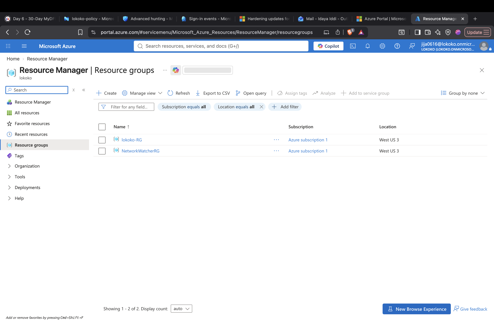
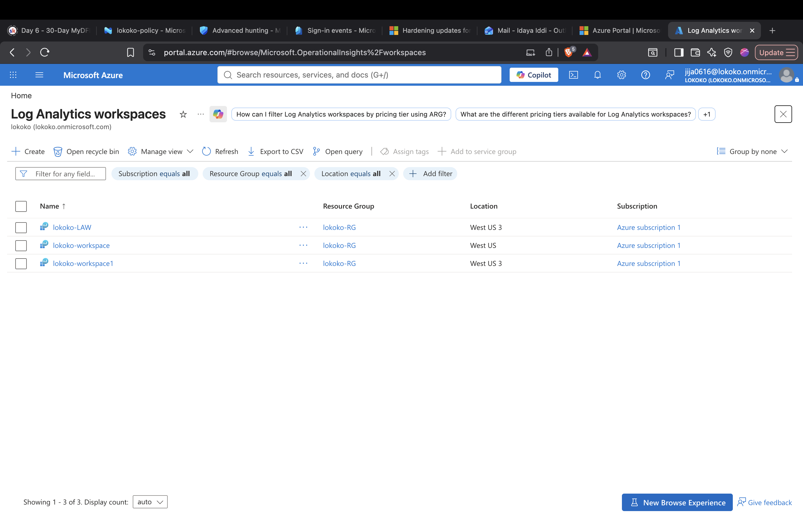
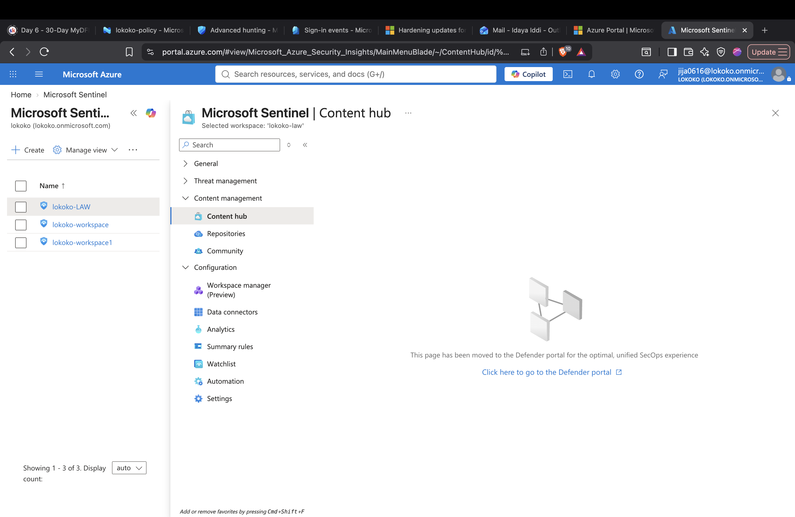

# Microsoft Sentinel Lab Setup

## Objective

The goal of this lab was to build a Microsoft Sentinel environment that I 
could use to practice SOC analysis, KQL, threat hunting, and incident 
investigation.

## Environment

- Microsoft Azure
- Microsoft Sentinel
- Log Analytics Workspace
- Azure Virtual Machine
- Microsoft 365
- Microsoft Sentinel training data

## What I Configured

1. Created an Azure resource group.
2. Created a Log Analytics Workspace.
3. Enabled Microsoft Sentinel.
4. Connected security data sources.
5. Configured a Windows VM as a test endpoint.
6. Verified that logs were reaching the environment.
7. Used KQL to search and analyze the collected data.

## Skills Practiced

- SIEM configuration
- Log collection
- Microsoft Sentinel
- Log Analytics
- KQL
- Security monitoring
- SOC lab development

## Lab Setup Evidence

### 1. Azure Resource Group

I created the `lokoko-RG` resource group to organize the Azure resources used in my Microsoft Security lab.

The resource group provides a central location for managing the resources used in my lab environment.

### 2. Log Analytics Workspaces

I configured Log Analytics workspaces to support log collection and analysis in my Microsoft Security lab.

Log Analytics provides the workspace where you can store and query security telemetry using KQL. Microsoft Sentinel uses a Log Analytics workspace to analyze security data for monitoring, detection, threat hunting, and investigation.

### 3. Microsoft Sentinel

I enabled Microsoft Sentinel on my Log Analytics workspace and used `lokoko-LAW` as one of the workspaces in my Microsoft Security lab.

Microsoft Sentinel provides the SIEM and security operations capabilities for my lab. From Sentinel, I can work with data connectors, analytics rules, automation, watchlists, and other security monitoring features.

This environment gives me a place to practice SOC tasks such as log analysis, KQL queries, threat hunting, detection, and incident investigation.

## What I Learned

This lab helped me understand how Microsoft Sentinel collects security data 
from different sources and makes that data available to a SOC analyst for 
searching, detection, investigation, and threat hunting.
