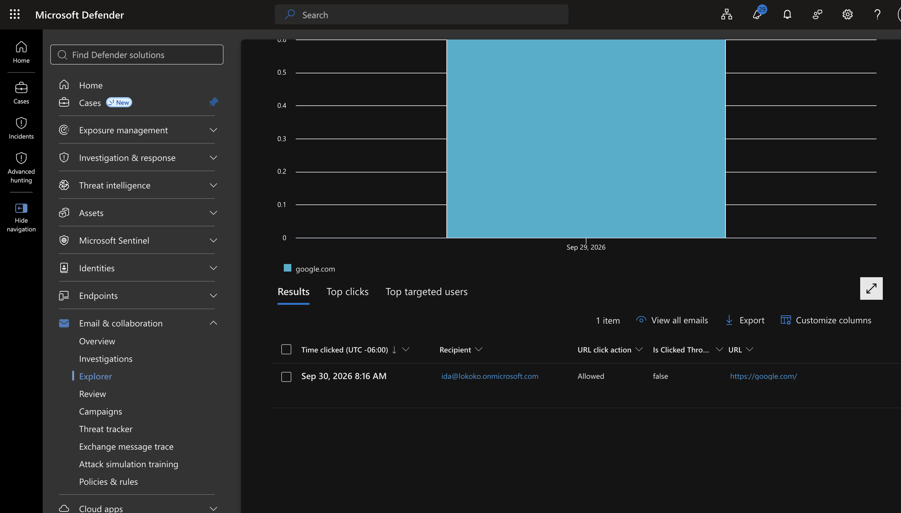
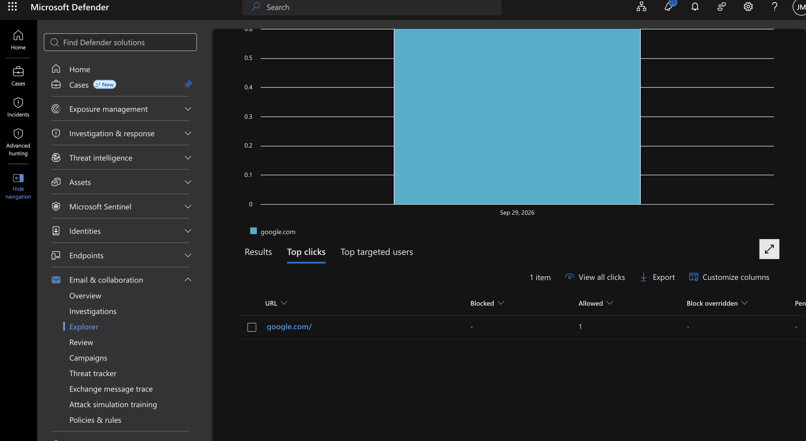
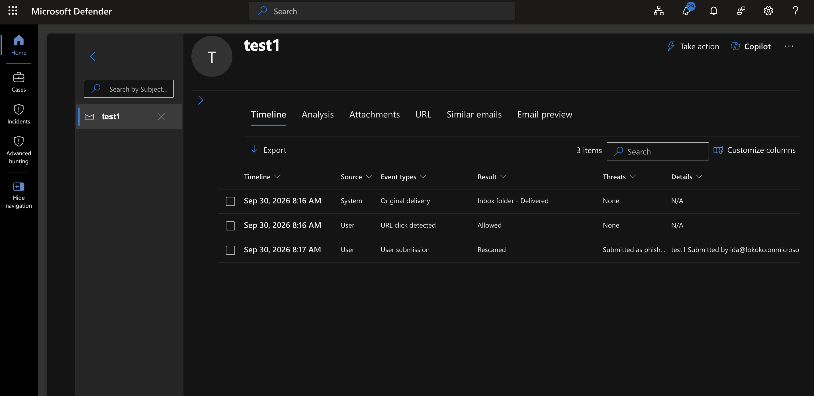
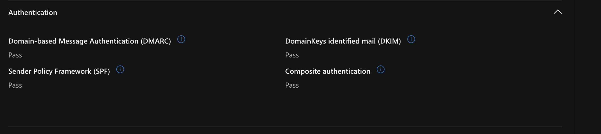
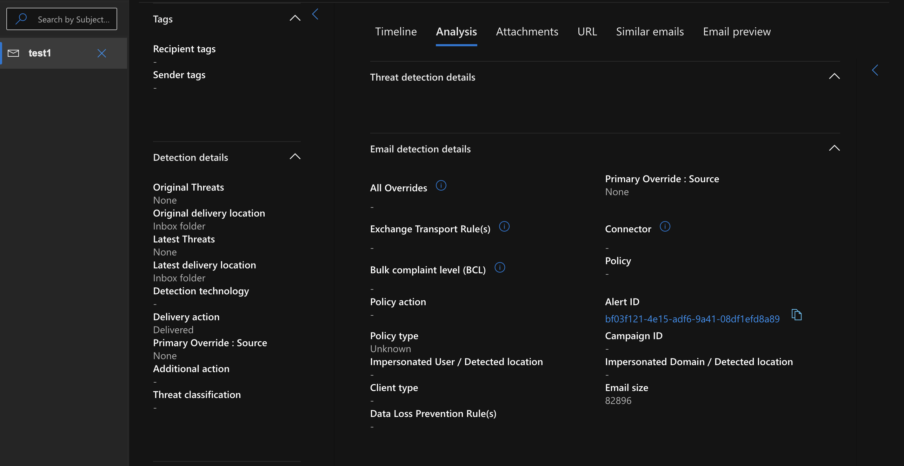

# Email Threat Hunting & Incident Response Using Microsoft Defender

## 1. Investigation Overview

**Platform:** Microsoft Defender for Office 365  
**Tools:** Threat Explorer, Email Entity, URL Click Investigation  
**Environment:** Microsoft 365 SOC Home Lab  
**Investigation Type:** Email Threat Hunting / Phishing Investigation  
**Email Subject:** test1  
**Final Disposition:** No malicious activity confirmed

## 2. Objective

The objective of this investigation was to practice how a SOC analyst investigates a potentially suspicious email using Microsoft Defender.

I wanted to understand how to trace an email from delivery to user interaction, examine email authentication, investigate URL clicks, and determine whether the email presented a security threat.

## 3. Investigation Hypothesis

An email containing a URL was delivered to a user. The user may have clicked the link, potentially exposing the organization to a phishing attack.

**Hypothesis:** The email may contain a malicious link designed to redirect the recipient to a phishing website.

To investigate this, I needed to answer the following questions:

1. Who sent and received the email?
2. Was the email successfully delivered?
3. Did the user click any links?
4. Did the email pass authentication checks?
5. Did Microsoft Defender detect malicious content?
6. Was any security alert generated?

## 4. Investigation Process

### Step 1: Identify the Email in Threat Explorer

I opened Microsoft Defender and navigated to Threat Explorer to review email activity.

I identified the test email and examined its details.

| Field | Value |
|---|---|
| Subject | test1 |
| Sender | gilemsafirislc@gmail.com |
| Recipient | ida@lokoko.onmicrosoft.com |
| Date | September 30, 2026 |
| Delivery status | Delivered |
| Direction | Inbound |

**Observation:** The email was successfully delivered to the recipient's inbox.

### Step 2: Investigate URL Click Activity

I opened the URL clicks section in Threat Explorer to determine whether the recipient interacted with the email.

**Findings:**

- URL: https://google.com/
- URL click action: Allowed
- Recipient: ida@lokoko.onmicrosoft.com
- Click activity: Recorded

**Observation:** Microsoft Defender recorded a URL click and showed that the action was allowed.

The recorded URL was a Google website. The available evidence did not indicate that the URL was malicious.

### Step 3: Analyze the Email Timeline

I opened the Email Entity page and reviewed the timeline to understand the sequence of events.

| Time | Event | Result |
|---|---|---|
| 8:16 AM | Original delivery | Delivered to Inbox |
| 8:16 AM | URL click detected | Allowed |
| 8:17 AM | User submission | Rescanned |

*Times shown are from September 30, 2026, UTC−06:00.*

**Observation:** The email was delivered, a URL click was recorded, and the user subsequently submitted the email for additional analysis.

### Step 4: Examine Email Authentication

I reviewed the authentication information to determine whether the email passed Microsoft's sender authentication checks.

| Authentication | Result |
|---|---|
| SPF | Pass |
| DKIM | Pass |
| DMARC | Pass |
| Composite authentication | Pass |

**Observation:** All four authentication checks passed.

However, passing authentication does not guarantee that an email is safe. An attacker can send phishing emails from a domain they control.

### Step 5: Review Threat Detection Details

I examined the Analysis tab to identify any threats associated with the email.

**Findings:**

- Original threats: None
- Latest threats: None
- Attachments: 0
- URLs: 1
- Threat classification: Not specified
- Detection technology: Not specified
- Latest delivery location: Inbox

**Observation:** Microsoft Defender did not identify malicious content in the available investigation results.

**Evidence:** Screenshot of the Analysis tab and threat detection details.

### Step 6: Check for Security Alerts

I searched Microsoft Defender's Alerts page for a matching alert related to the test email.

**Result:** No matching alert was found.

This means I could not confirm a corresponding security alert through the search performed. It does not prove that no alert exists elsewhere or outside the selected search range.

## 5. Final Investigation Findings

The investigation confirmed that the email was delivered to the recipient and that a URL click occurred.

Microsoft Defender recorded the user's interaction and subsequent email submission. The email passed authentication checks, and the available analysis did not identify malicious attachments, URLs, or other threats.

Although the email contained a URL, there was no evidence confirming that the link was malicious or that the user experienced a successful phishing attack.

## 6. Incident Response Decision

**Disposition: No malicious activity confirmed.**

Based on the available evidence, I did not identify a reason to quarantine the email, block the sender, or isolate an endpoint.

No containment or remediation action was performed during this investigation.

The case was assessed as a benign test email based on the evidence reviewed.

## 7. Lessons Learned

This investigation helped me understand how Microsoft Defender supports email threat hunting and incident response.

I learned how to:

- Investigate email delivery using Threat Explorer.
- Review URL click activity and user interactions.
- Reconstruct events using an email timeline.
- Analyze SPF, DKIM, and DMARC authentication results.
- Examine threat detection details.
- Search for related security alerts.
- Make an investigation decision based on evidence rather than assumptions.

**Key takeaway:** An email containing a link is not automatically phishing. As a SOC analyst, I must investigate the sender, email authentication, URL activity, threat detection results, and user behavior before deciding whether the email is malicious.

## 8. Investigation Limitations

This investigation used a controlled test email rather than a confirmed phishing attack.

The available evidence did not demonstrate a successful phishing detection, blocking action, or endpoint compromise.

The investigation therefore demonstrates email analysis and SOC decision-making, not successful prevention of a real phishing attack.
