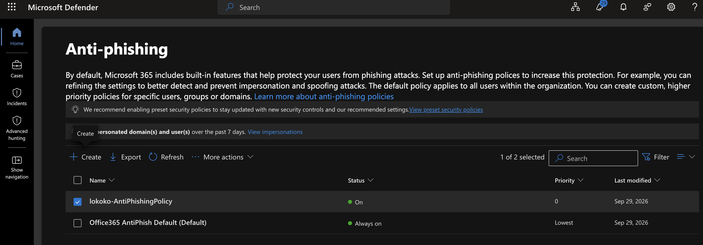
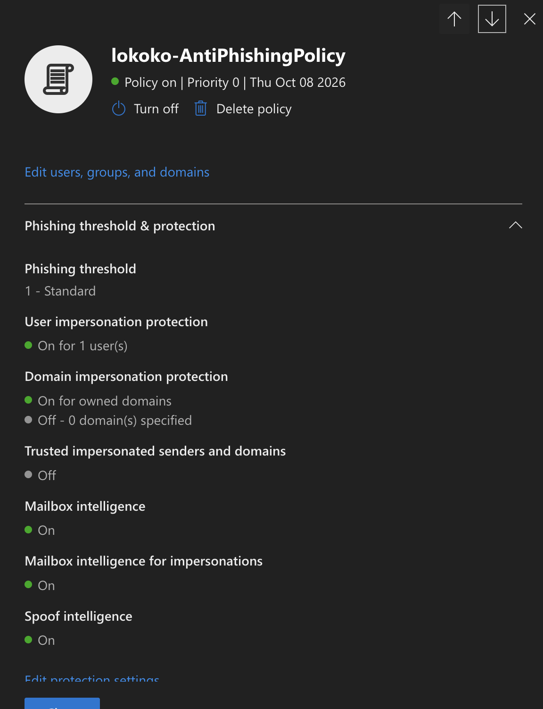
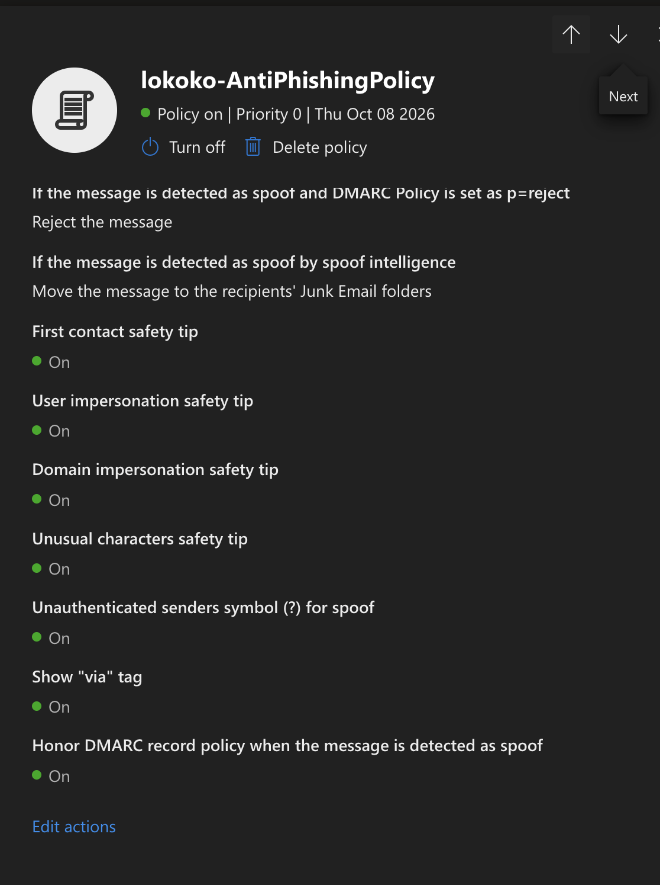
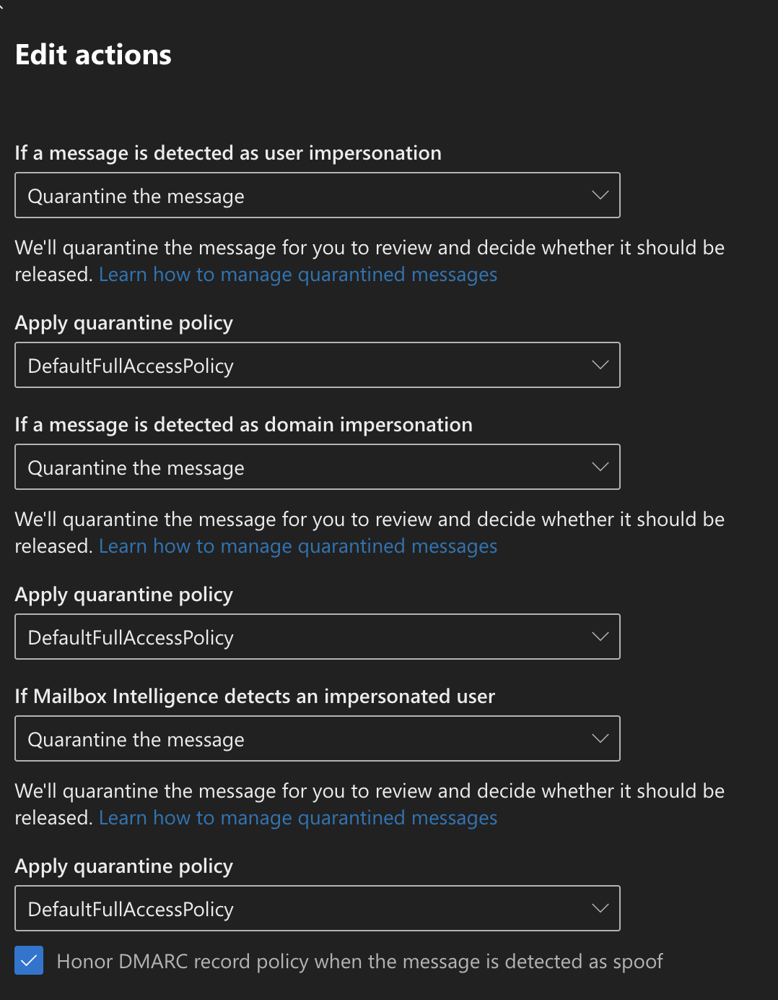

## Microsoft Defender Anti-Phishing Policy

### Objective

Configure and review an Anti-Phishing policy in Microsoft Defender for Office 365 to protect users against email impersonation and spoofing attacks.

### Lab Environment

- **Security Platform:** Microsoft Defender for Office 365
- **Policy Name:** `lokoko-AntiPhishingPolicy`
- **Protected Recipient Domain:** `lokoko.onmicrosoft.com`
- **Protected Users:** 1 user configured for impersonation protection
- **Phishing Threshold:** 1 - Standard
- **Policy Status:** Enabled

### 1. Policy Configuration

I reviewed an existing Anti-Phishing policy in the Microsoft Defender portal under:

**Email & collaboration → Policies & rules → Threat policies → Anti-phishing**

I verified the following security settings:

| Security Setting | Configuration |
|---|---|
| User impersonation protection | Enabled |
| Domain impersonation protection | Enabled for owned domains |
| Mailbox intelligence | Enabled |
| Mailbox intelligence for impersonation protection | Enabled |
| Spoof intelligence | Enabled |
| Honor DMARC policy | Enabled |
| First contact safety tip | Enabled |
| User impersonation safety tip | Enabled |
| Domain impersonation safety tip | Enabled |
| Unusual characters safety tip | Enabled |

### 2. Security Configuration Review

While reviewing the policy, I discovered that some protections were enabled but their message actions were not configured to quarantine suspicious emails.

**Initial findings:**

- User impersonation: Quarantine the message
- Domain impersonation: Don't apply any action
- Mailbox intelligence impersonation: Don't apply any action

This was an important observation because enabling a detection feature does not automatically mean that suspicious messages will be blocked or quarantined.

### 3. Security Improvements

I updated the policy to strengthen its response to impersonation attempts.

| Detection Type | Updated Action |
|---|---|
| User impersonation | Quarantine |
| Domain impersonation | Quarantine |
| Mailbox intelligence impersonation | Quarantine |
| Spoof intelligence | Move to Junk Email |
| Spoof with DMARC p=quarantine | Quarantine |
| Spoof with DMARC p=reject | Reject |

The quarantine actions are intended to prevent suspicious messages from reaching users while allowing administrators to review them.

### 4. Why This Policy Matters

Attackers frequently use phishing emails to trick employees into sharing passwords, clicking malicious links, or downloading malware.

An Anti-Phishing policy helps reduce these risks by identifying suspicious sender identities.

**User impersonation protection** helps detect emails pretending to come from trusted individuals.

**Domain impersonation protection** helps identify messages impersonating trusted organizations or domains.

**Mailbox intelligence** analyzes communication patterns to help identify unusual sender behavior.

**Spoof intelligence** helps identify messages using forged sender identities.

**Safety tips** warn users about suspicious sender characteristics.

### 5. Evidence

**Screenshot 1: Anti-Phishing Policy Overview**

**Screenshot 2: Impersonation and Spoof Protection**

**Screenshot 3: Initial Message Actions**

**Screenshot 4: Updated Message Actions**

### 6. Verification and Results

I confirmed that the custom Anti-Phishing policy was enabled and reviewed its impersonation, spoof intelligence, and mailbox intelligence settings.

During the review, I identified two message actions that needed improvement and changed them to quarantine suspicious messages.

The configuration review is complete. However, I have not yet performed a phishing simulation to confirm how Microsoft Defender responds to test messages.

### 7. SOC Analyst Takeaway

This exercise helped me understand that security policies need more than just enabled protection settings.

As a SOC analyst, I should also review what happens when a threat is detected.

For example, if impersonation protection is enabled but the action is set to "Don't apply any action," suspicious messages may still reach users.

I learned how to review email security controls, identify configuration gaps, and improve the response actions to reduce phishing risks.
