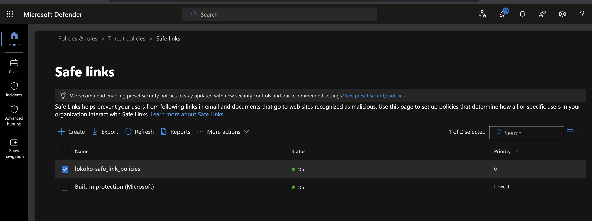
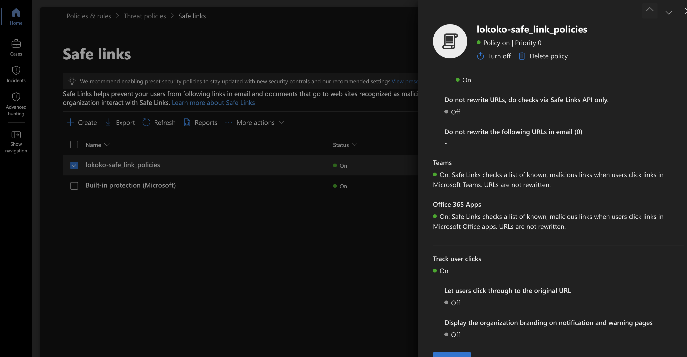

## Step 2: Microsoft Defender Safe Links Policy

### Objective

Configure and verify a Safe Links policy in Microsoft Defender for Office 365 to help protect users against malicious URLs in email messages.

### Configuration

I created a custom Safe Links policy named `lokoko-safe_link_policies` and applied it to the `lokoko.onmicrosoft.com` domain.

I verified the following security settings:

- **Safe Links for Email:** Enabled
- **Internal Email Protection:** Enabled
- **Real-Time URL Scanning:** Enabled
- **Wait for URL Scanning Before Delivery:** Enabled
- **Microsoft Teams Protection:** Enabled
- **Office 365 Apps Protection:** Enabled
- **Track User Clicks:** Enabled
- **Allow Users to Click Through to Original URL:** Disabled
- **Email URL Rewriting:** Enabled

### Why This Policy Matters

Phishing emails often contain links that direct users to malicious websites. Attackers may use these websites to steal login credentials or distribute malware.

Safe Links helps reduce this risk by checking URLs and blocking access to known malicious destinations.

Enabling click tracking also helps SOC analysts investigate whether users interacted with suspicious links.

Disabling the option to click through blocked URLs provides additional protection by preventing users from bypassing Safe Links warnings.

### Evidence

**Screenshot 1: Safe Links Policy Configuration**

**Screenshot 2: Safe Links Click Tracking and Protection Settings**

### Verification Results

I confirmed that the Safe Links policy was enabled and that URL scanning, click tracking, and protection settings were configured.

The policy also applies to Microsoft Teams and supported Microsoft 365 applications.

At this stage, I verified the policy configuration but have not yet tested its ability to detect or block a malicious URL.

### SOC Analyst Takeaway

I learned that Safe Links is an important email security control that helps protect users against phishing links.

I also learned that enabling a security policy is different from verifying that it detects threats.

My next goal is to simulate a phishing email in a controlled lab and investigate how Microsoft Defender responds.
