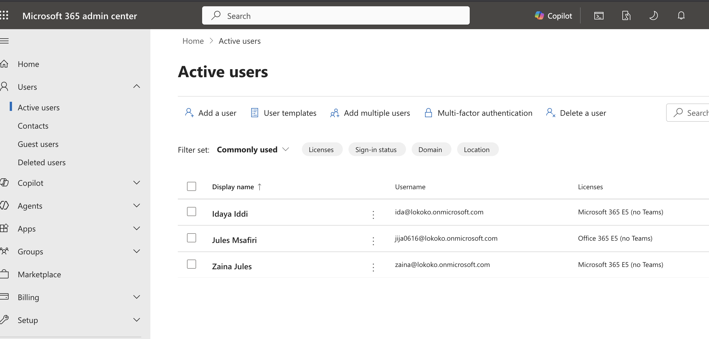
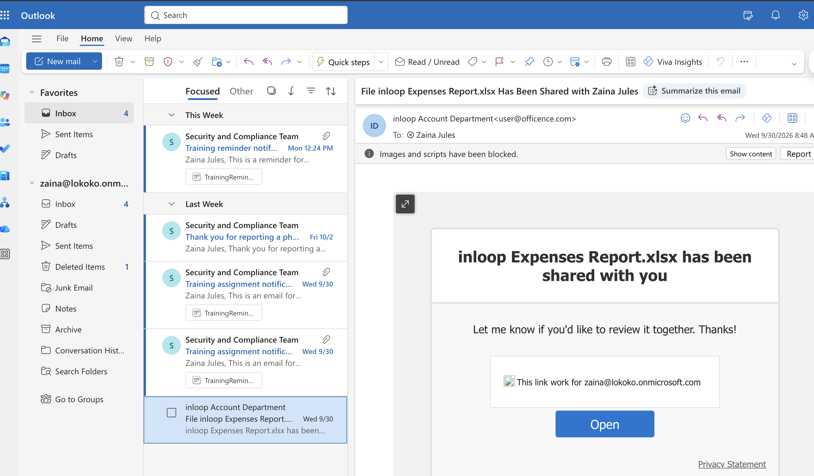

# Microsoft 365 Email Security Lab

## Project Overview

The goal of this lab is to learn how Microsoft Defender for Office 365 helps protect users from email-based threats such as phishing, malicious links, and email impersonation.

I will configure email security policies, test how they work, investigate the results, and document my findings from a SOC analyst perspective.

## Step 1: User Accounts and Mailbox Configuration

### Objective: 
Create two test users in Microsoft 365 and prepare their mailboxes for email security testing.

### Configuration Steps

1. Created two test user accounts in the Microsoft 365 environment.
2. Assigned Microsoft 365 E5 licenses to both users.
3. Opened https://outlook.office.com.
4. Signed in using the test accounts to verify mailbox access.

### Why This Matters

Before testing email security policies, I needed working mailboxes to send and receive test emails.

The two accounts will help me simulate email communication and investigate how Microsoft Defender handles suspicious messages.

### Evidence

**Screenshot 1: Microsoft 365 User License Assignment**

**Screenshot 2: Outlook Mailbox Verification**

### SOC Analyst Takeaway

I learned that configuring users, assigning licenses, and verifying mailbox access are important preparation steps before testing email security controls.

Having test accounts allows me to investigate email threats in a controlled environment without involving real users.
