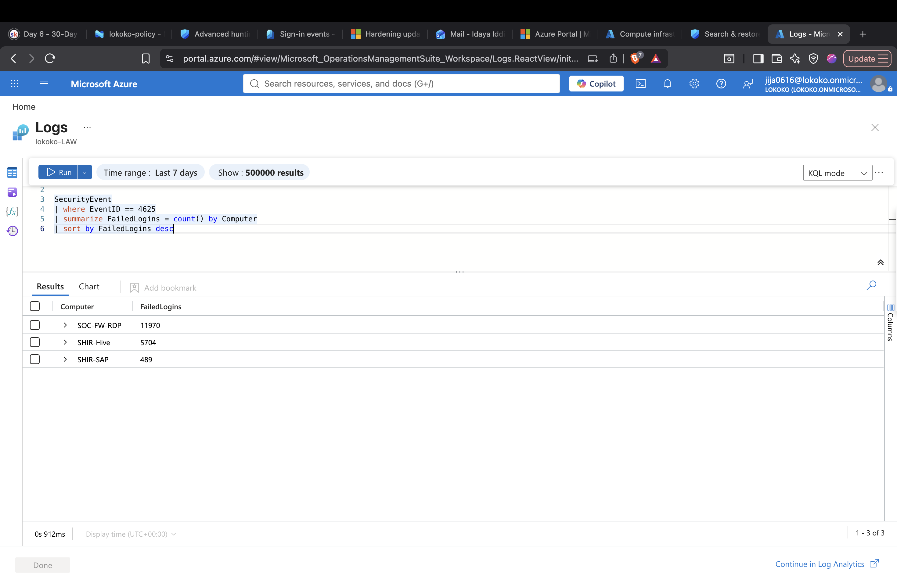
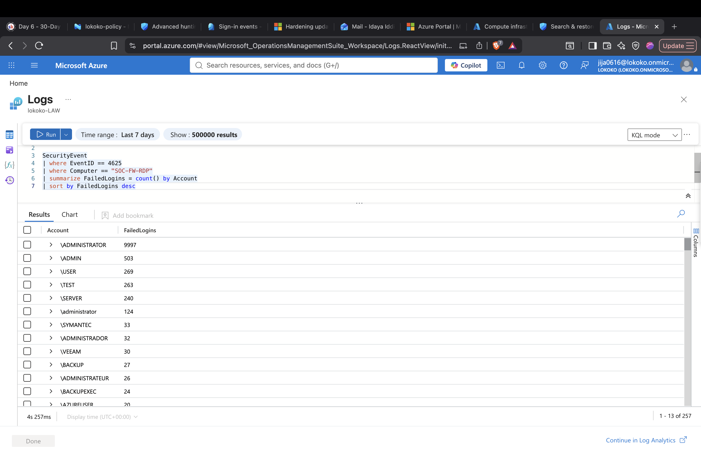
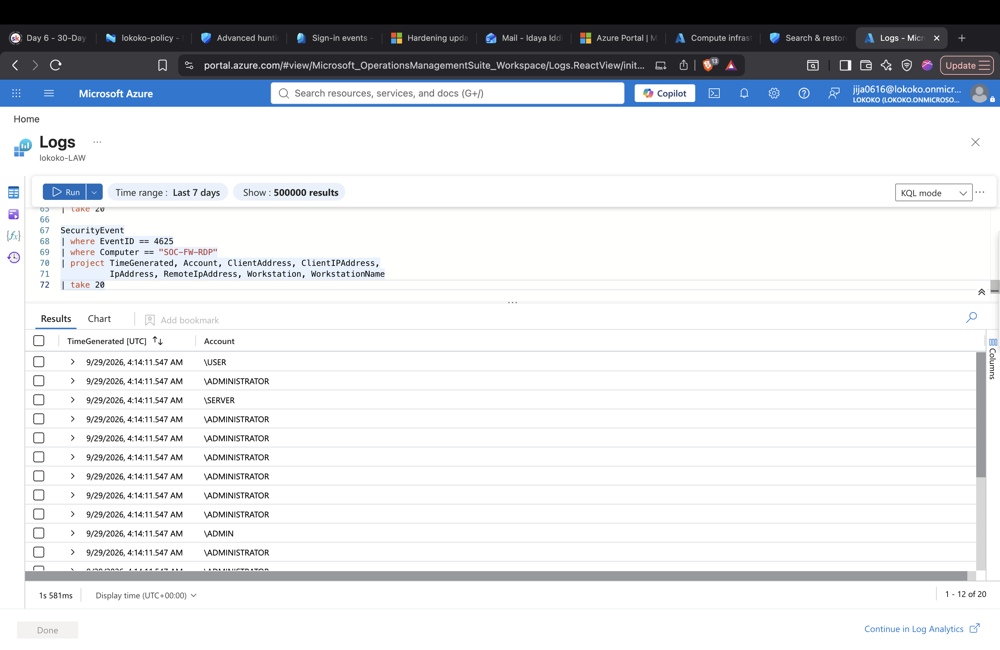
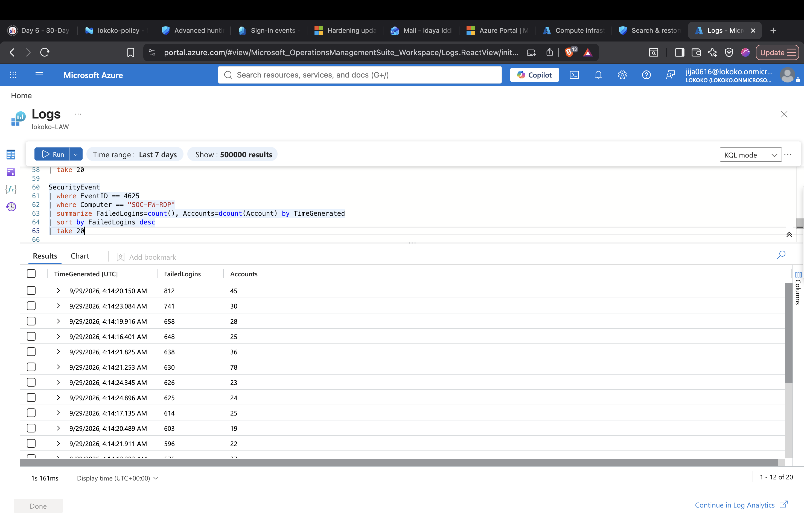

# Microsoft Sentinel KQL Fundamentals

## Objective

The goal of this lab is to practice using Kusto Query Language (KQL) to search, filter, organize, and analyze security data in Microsoft Sentinel.

Instead of only running queries, I focused on understanding what question each query answers from a SOC analyst's point of view.

## Environment

- Microsoft Sentinel
- Log Analytics Workspace
- Microsoft Sentinel training data
- Kusto Query Language (KQL)

## Skills Practiced

- Identifying available security tables
- Filtering security events
- Selecting important fields
- Sorting events by time
- Counting and summarizing events
- Identifying systems generating security events
- Investigating authentication activity
- Building queries around an investigation question

## Investigation Approach

For each query, I followed this process:

1. Ask a security question.
2. Identify the table that may contain the answer.
3. Write a simple KQL query.
4. Review the results.
5. Add filters to reduce unnecessary data.
6. Identify anything unusual.
7. Document what the results mean.

## KQL Investigations

The following sections document the KQL queries I used and what I learned from the results.

### Investigation 1: Identifying Systems with High Failed Logon Activity

#### Security Question

Which computers generated the most failed Windows logon events during the last 7 days?

#### KQL Query




```kusto
SecurityEvent
| where EventID == 4625
| summarize FailedLogins=count() by Computer
| sort by FailedLogins desc
```

#### Summary

I used Windows Security Event ID 4625 to identify systems with failed logon activity during the last 7 days.

The results showed that `SOC-FW-RDP` had the highest number of failed logons with 11,970 events, followed by `SHIR-Hive` with 5,704 and `SHIR-SAP` with 489.

The large number of failed logons on `SOC-FW-RDP` stood out, but this alone does not confirm malicious activity. I decided to investigate this system further to determine which accounts were involved and where the failed logon attempts were coming from.

### Investigation 2: Identifying Targeted Accounts

#### Security Question

Which accounts generated the failed logon attempts on `SOC-FW-RDP`?

#### KQL Query

```kusto
SecurityEvent
| where EventID == 4625
| where Computer == "SOC-FW-RDP"
| summarize FailedLogins=count() by Account
| sort by FailedLogins desc
```



#### Findings

The results showed failed authentication attempts against many different account names.

The account `\ADMINISTRATOR` had the highest number of failed logons with 9,997 attempts. Other account names included `\ADMIN`, `\USER`, `\TEST`, `\SERVER`, `\BACKUP`, and `\VEEAM`.

#### Analyst Thinking

The large number of failures against `\ADMINISTRATOR` stood out. I also noticed that many different generic or administrative account names were attempted.

This pattern could be consistent with automated account or password guessing. However, the account names alone are not enough to confirm an attack.

I needed to determine where these authentication attempts originated.

#### Next Question

Which source IP addresses generated the failed logon attempts against `SOC-FW-RDP`?

```kusto
SecurityEvent
| where EventID == 4625
| where Computer == "SOC-FW-RDP"
| project TimeGenerated, Account, ClientAddress, ClientIPAddress,
          IpAddress, RemoteIpAddress, Workstation, WorkstationName
| take 20
```
The query above asks Sentinel:
  - For these failed logons, show me every likely field that might identify where the connection come from.


The search did not provide me with any information that confirms where the connections were coming from, which means that the dataset doesn't provide source-network information for these 4625 records. Thus, we have a telemetry limitation, and I switched my focus to pivoting on other evidence, such as timing, logon type, failure reason/status, and whether any attempts eventually succeeded.

### Investigation 3: Analyzing Failed Logon Timing

#### Security Question

Were the failed logon events on `SOC-FW-RDP` spread over time, or were they concentrated within a short period?

#### KQL Query

```kusto
SecurityEvent
| where EventID == 4625
| where Computer == "SOC-FW-RDP"
| summarize FailedLogins=count(), Accounts=dcount(Account) by TimeGenerated
| sort by FailedLogins desc
| take 20
```


#### Findings

The failed logon activity was highly concentrated around 04:14 UTC on September 29, 2026. 
Several timestamps contained hundreds of failed authentication events. For example:
- 04:14:20.150 — 812 failed logons involving 45 account names
- 04:14:23.084 — 741 failed logons involving 30 account names
- 04:14:19.916 — 658 failed logons involving 28 account names
- 04:14:16.401 — 648 failed logons involving 25 account names
- 04:14:21.253 — 630 failed logons involving 78 account names

#### Analyst Notes

The high number of failed logons occurring within seconds suggests that the activity may have been automated rather than caused by normal users entering incorrect passwords.

At this stage, I did not classify the activity as a confirmed brute-force or password-spraying attack. More investigation is needed to determine which accounts were targeted and whether the authentication pattern matches a specific attack technique.

#### Next Step

Investigate the accounts targeted by the failed authentication attempts to determine whether the activity focused on one account or was distributed across many accounts.
